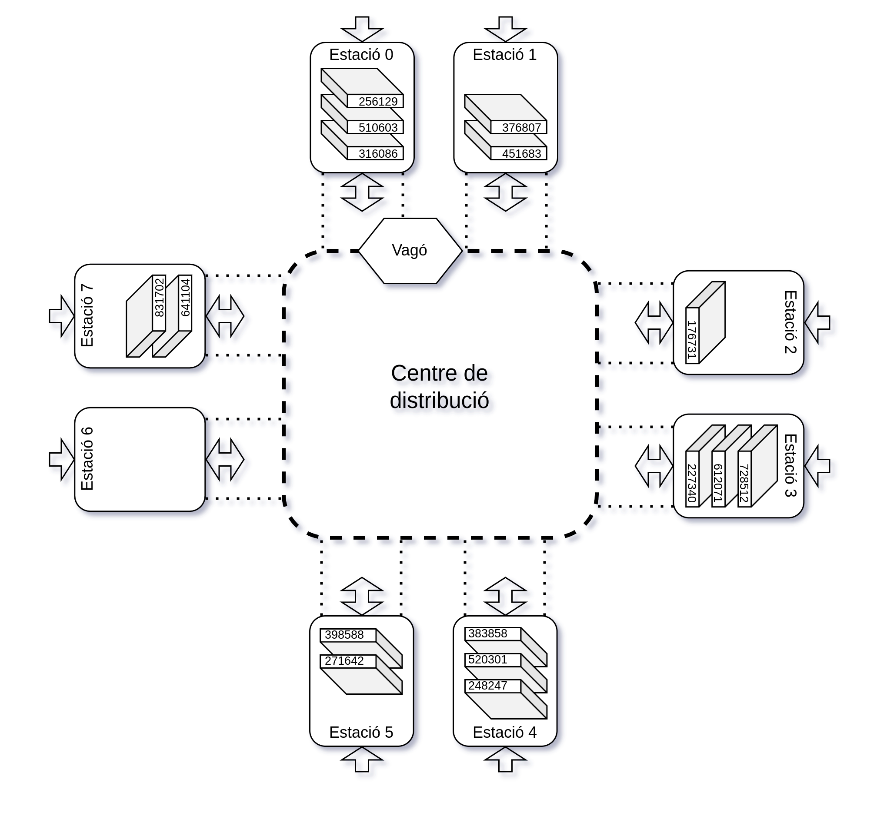
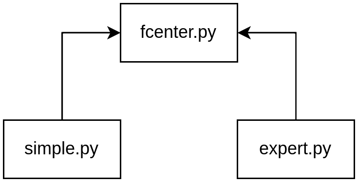

# Pràctica GCED-AP2 2023


## Introducció

Ens trobem en un centre de distribució de paquets. Els paquets tenen pesos i valors diferents. El centre de distribució té un cert nombre d'estacions, connectades amb un sistema de vies en disposició cíclica. Els paquets poden arribar a qualsevol de les estacions, i cal transportar-los a una altra estació adient. Disposem d'un vagó que transita sobre les vies movent-se entre estacions, amb la capacitat de carregar i descarregar paquets, limitat per un pes màxim dels paquets que transporta.

A la figura següent tenim la representació d'un centre de distribució amb vuit estacions:



Al principi, el vagó es troba buit i davant de la primera estació, i les estacions no tenen cap paquet.

El vagó es capaç de moure's entre estacions, de recollir paquets per (sempre que la suma dels pesos dels paquets carregats no superi la seva capacitat) i de lliurar els paquets en les estacions de destinació adients. El vagó només pot accedir als paquets en ordre d'arribada a l'estació a l'hora de recollir-los d'aquella estació. El vagó triga una unitat de temps en carregar un paquet, una unitat de temps en lliurar-lo i una unitat de temps en moure's entre estacions adjacents.

Els paquets van arribant en instants de temps a alguna de les estacions. Quan un paquet es lliura a la seva estació de destí, obtenim un benefici que ve indicat en el paquet.

Per tal de guanyar tants diners com sigui possible, el director del centre de distribució us ha contractat per tal que dissenyeu i implementeu estratègies per gestionar el moviment del vagó. Heu de decidir doncs mon moure el vagó i quins paquets recollir i lliurar, i quan fer-ho. La vostra estratègia serà provada tot simulant-la amb unes dades d'entrada públiques i privades. Les privades tindran unes característiques semblants a les públiques.

De fet, cal que implementeu dues estratègies: la primera l'anomenem *L'estratègia simple* i hauria de funcionar (essencialment) igual per tothom. La segona és la vostra pròpia estratègia i l'hauríeu de fer millor que les de la competència!


## L'estratègia simple

Aquesta estratègia es basa en moure sempre el vagó en la mateixa direcció, tot passant una per una per totes les estacions cíclicament, deixant els paquets que hi van adreçats tan aviat com poguem i recollint tots els que suporti el vagó.

Podeu veure una execució d'aquesta estratègia a [YouTube](https://youtu.be/8UbUOdsOHd8).

La simulació acaba quan arriba el darrer paquet. Per tant, és possible que no tots els paquets es puguin lliurar.


## L'estratègia experta

L'estratègia experta és una estratègia que vosaltres heu de dissenyar. Ha de ser original vostra i ha de maximitzar el benefici obtingut amb un joc de proves que coneixereu després del lliurament.

La simulació també acaba quan arriba el darrer paquet.


## Funcionament de la pràctica

Aquesta pràctica té dues parts:

1.  A la primera part heu d'escriure un mòdul per gestionar magatzems de  paquets i dues estratègies per entrar-hi i treure'n paquets. La primera estratègia és l'estratègia simple explicada anteriorment. La segona estratègia és la vostra estratègia experta.

    TODO Heu de lliurar la pràctica a través de l'aplicació Eduflow. Per a fer-ho, aneu a https://app.eduflow.com/join/TODO TODO. A continuació, creu un nou compte introduint el vostre nom complet, el vostre correu electrònic oficial (acabat amb `@estudiantat.upc.edu`) i una contrasenya (recordeu-la!). Lliureu en un fitxer ZIP tots els fitxers necessaris però tingueu cura de **NO** identificar-ne cap amb el vostre nom o altre informació personal vostra: el vostre lliurament ha de ser completament anònim.

    TODO La data límit per lliurar la primera part de la vostra pràctica és el dimarts 18 d'abril de 2022 fins a les 23:59.

2.  A la segona part de la pràctica haureu de corregir tres pràctiques d'altres companys. Aquesta correcció es farà també a través de Eduflow i implicarà valorar diferents rúbriques que només veureu en aquest punt.

    L'avaluació també serà anònima. El sistema calcularà automàticament la nota de cada estudiant i també avisarà als professors de possibles incoherències. Els abusos seran penalitzats. Cada estudiant té el dret de rebutjar la nota rebuda pels seus companys i pot demanar l'avaluació per part d'un professor (qui podrà puntuar a l'alta o a la baixa respecte l'avaluació dels estudiants). Els professors també poden corregir pràctiques "d'ofici" i substituir la nota rebuda pels companys per la del professor.

    TODO Podeu començar a corregir les pràctiques dels vostres companys a partir del dimecres 19 d'abril a les 8:00. La data límit per lliurar la segona part de la vostra pràctica és el dimarts 29 d'abril a les 23:59. No podreu veure les correccions dels vostres companys fins que no hagueu donat les vostres correccions.

Totes les pràctiques s'han de fer en solitari. Els professors utilitzaran programes detectors de plagi. És obligatori corregir les pràctiques dels tres companys assignades pel sistema.


## Disseny del sistema

El vostre sistema tindrà tres mòduls en Python:

- `fcenter.py`: Aquest mòdul contindrà els tipus, classes i funcions relacionats amb la gestió del centre de distribució i els paquets.

- `simple.py`: Aquest mòdul contindrà el codi relacionat amb la vostra implementació de l'estratègia simple.

- `expert.py`: Aquest mòdul contindrà el codi relacionat amb la vostra implementació de l'estratègia experta.

Aquest és el diagrama de mòduls:



Per als tres mòduls, ja us donem un esquelet amb la interfície que haureu de seguir i implementar. No teniu dret a canviar la interfície pública, però evidentment, podeu afegir les parts privades que us convinguin. Si us cal, també podeu extendre la interfície pública, però sempre preservant la que se us ha donat. A més, per estalviar-vos feina, algunes operacions ja se us dónen implementades (per exemple, les de visualització o execució d'estratègies).

Aquests són els fitxers de l'esquelet:

- [fcenter.py](templates/fcenter.py)
- [simple.py](templates/simple.py)
- [expert.py](templates/expert.py)


## El mòdul `fcenter.py`

Aquesta mòdul està estructurat al voltant d'uns quants tipus que representen les entitats del problema.

### TimeStamp

El tipus `TimeStamp` representa un instant de temps. És equivalent a un `int`.

### Identifier

El tipus `Identifier` representa la identificació única d'un paquet. És equivalent a un `int`.

### Direction

L'enumeració `Direction` representa les direccions del vagó. Només pot pendre els valors 1 (endavant) i -1 (endarrera).

```python3
class Direction(Enum):
    RIGHT = 1
    LEFT = -1
```

> Em sembla bé però no ho coneixen. Ho deixem així?

### Package

L'estructura `Package` representa paquets. N'emmagatzema el seu identificador, el temps d'arribada, l'estació en la que es troba, l'estació on ha d'arribar, el seu pes i el valor que ens aporta la seva entrega:

```python3
@dataclass
class Package:
    identifier: Identifier
    arrival: TimeStamp
    location: int
    destination: int
    weight: int
    value: int
```

> Suposo que caldria dir que cap paquet arriba a la mateixa estació a la qual està destinat. Però, es poden descarregar paquets en l'estació on no estàn destinats? Si es pot, què passa? Es posen a la cua?

> La `location` què és? L'estació d'orígen? Potser llavors en podríem dir `source`. Perquè si no, quan el paquet és al vagó, què val?

### Station

La clase `Station` representa estacions i implementa la seva lógica.

```python3
class Station:
    packages: deque[Package]

    ...
```

### Wagon

La clase `Wagon` representa el vagó i implementa la seva lógica.

```python3
class Wagon:
    pos: int
    packages: dict[Package]   # ??? list? o dict[Identifier, Package]?
    num_stations: int         # ??? aquí? és per fer "la volta"?
    capacity: int
    current_load: int         # aquest el podríem amagar...

    def __init__(self, num_stations: int, capacity: int) -> None: ...
    def move(self, direction: Direction) -> None: ...
    def load_package(self, p: Package) -> None: ...
    def deliver(self, identifier: Identifier) -> int: ...
```

> Ens cal requirir aquests mètodes? No els haurien de posar ells? Les dades sí que ens calen pel dibuix.

### FullfilmentCenter

> DistributionCenter?

La clase `FullfilmentCenter` representa el centre de distribució i implementa la seva lógica. Els centres de distribució es creen amb un cert nombre d'estacions i un cert pes màxim pel vagó, i ha d'implementar les següents funcions:

```python3
class FullfilmentCenter:
    ...

    def __init__(self, num_stations: int, wagon_capacity: int) -> None: ...
    def cash(self) -> int: ...
    def num_stations(self) -> int: ...
    def wagon(self) -> Wagon: ...
    def station(self, idx: int) -> Station: ...
    def recieve_package(self, p: Package) -> None: ...
    def deliver_package(self, identifier: Identifier) -> None: ...
    def available_package(self) -> Package | None: ...
    def load_available_package(self): ...
    def write(self, stdscr: curses.window, caption: str = ''): ... # ja implementat
```

> recieve_package spelling

El significat de cada mètode hauria de ser prou clar pel seu nom i paràmetres, però és necessari que el feu explícit amb una especificació completa usant *docstrings*. Tots els mètodes haurien de llançar una excepció si s'executen amb paràmetres invàlids. Deixeu-ho també especificat.

> Doncs jo no he sabut entendre què els el available_package i el load_available_package.

Quan implementeu la classe `FullfilmentCenter`, suposeu que el nombre d'estacions i el pes màxim del vagó poden ser molt grans. Això afectarà la tria de les estructures de dades subjacents.

El mètode `write` ja se us dóna implementat usant la resta d'operacions públiques. Aquest utilitza la llibreria `curses` per poder escriure en coloraines en un terminal.


### read_packages

La funció `read_packages` ja se us dóna implementada i retorna la llista de paquets continguts en el fitxer que se li passa com a paràmetre:

```python3
def read_packages(path: str) -> list[Package]: ...
```

El format d'aquest fitxer és senzill: a cada línia es dóna la descripció d'un paquet amb els seus atributs: identificador, temps d'arribada, estació on arriba inicialment, estació de destí, pes i valor.

Aquest és un exemple de fitxer de paquets:

```
242178 3 7 5 87 48
397826 5 4 3 154 164
352283 6 4 7 6 6
845856 10 5 4 381 492
```

Tots els identificadors són diferents. Fixeu-vos que els paquets venen ordenats per temps d'arribada.

### Logger

La senzilla classe `Logger` serveix per registrar tots els moviments que una estratègia realitza en un magatzem. Ja se us dóna implementada.

El registre es desa en un fitxer de text i serveix per poder comprovar que totes les accions realitzades per les estratègies són correctes i per poder visualitzar com evoluciona el magatzem al llarg del temps.

Fixeu-vos que l'`FullfilmentCenter` no en sap res del `Logger`, són les estratègies qui el faràn servir.

Els fitxers de registre són senzills: cada acció es desa en una línia amb la marca de temps en què s'ha realitzat. És convenient també desar-hi el benefici obtingut després de cada extracció de paquet a temps. Aquest és un exemple de fitxer de registre:

```
0 START MyStrategy 8 8000
0 MOVE 1
1 MOVE 1
2 MOVE 1
3 ADD 242178
3 MOVE 1
4 MOVE 1
5 ADD 397826
5 MOVE 1
6 ADD 352283
6 MOVE 1
7 LOAD 242178
```

> Estaria bé posar un exemple on es veu que dos paquets arribe al mateix instant o dir per algun lloc que no pot passar.

### check_and_show

La funció `check_and_show` serveix per comprobar (en certa mesura) que un fitxer de registre és correcte.
A més, també serveix per visualitzar l'evolució del centre de distribució al terminal. Ja se us dóna implementada utilitzant les operacions públiques de `FullfilmentCenter`.

```python3
def check_and_show(packages_path: str, log_path: str, stdscr: curses.window | None = None):
```

## El mòdul `simple.py`

El mòdul `simple.py` conté el codi de l'estratègia simple. Aquesta es realitza a través de la classe `Strategy`:

```python3
class Strategy:
    def __init__(
        self, 
        num_stations: int, 
        wagon_capacity: int, 
        log_path: str
    ): ...
    def cash(self) -> int: ...
    def exec(self, packages: list[Package]): ...
```

Cada estratègia es crea amb una amplada del magatzem i un nom de fitxer on es registraran les accions que l'estretègia aplica al magatzem.

El mètode `exec` és el cervell de l'estratègia i s'executa cada cop que arriba un nou paquet. Llavors, aquest `exec` pot realitzar tantes accions de la grua com hi hagi dins de l'intèrval de temps de l'arribada del paquet.

> ??? Això està bé?

El mòdul `simple.py` també ofereix una funció `main` que serveix per executar el programa. Podeu veure que simplement executa l'estratègia usant tres paràmetres donats a la línia de comandes: nom del fitxer de paquets, nom del fitxer de registre i amplada del magatzem. Podeu comentar/descomentar la línia del `check_and_show` per habilitar o deshabilitar la comprovació i visualització. El `main` és essencialment un capa per damunt de
la funció `execute_strategy(packages_path: str, log_path: str, num_stations: int, wagon_capacity: int)` que s'encarrega de llegir els paquets i anar cridant a `exec`.

El `main` també inclou unes instruccions necessàries per inicialitzar la llibreria `curses`, que s'encarrega de preparar les coloraines i posicionament dels textos al terminal. Podeu ignorar-ne els detalls.


## El mòdul `expert.py`

El mòdul `expert.py` és exactament igual que el `simple.py`, tret que ha d'implementar la vostra estratègia experta. Expliqueu en un comentari inicial el funcionament i elements més importants de la vostra estratègia i les seves raons.


## Jocs de proves

TODO Al directori [tests](tests) teniu els jocs de proves públics (llistes de paquets). Ara mateix només n'hi ha un ([simple.txt](tests/simple.txt)) amb 100 paquets, però aviat en posarem un de més llarg, semblant al privat que es publicarà després del lliurament.


## Consells

Per realitzar el treball us recomanem seguir aquests passos:

1. Implementeu el mòdul `fcenter.py`.
2. Implementeu la classe Strategy de `simple.py`.
3. Dissenyeu i implementeu la classe Strategy de `expert.py`.
4. Al llarg de tots els passos anteriors, comproveu que tot funciona correctament, documenteu el vostre codi amb comentaris i espcifiqueu els elements públics amb *docstrings*.

Per evitar problemes de còpies, no pengeu el vostre projecte en repositoris públics.

No espereu al darrer instant per fer el lliurement. De debò. No, no és bona idea. Podeu fer múltiples lliuraments, el bo és el darrer.


## Autors


Izan Beltran Ferreiro,
Jordi Cortadella,
Jordi Petit

Universitat Politècnica de Catalunya, 2023
